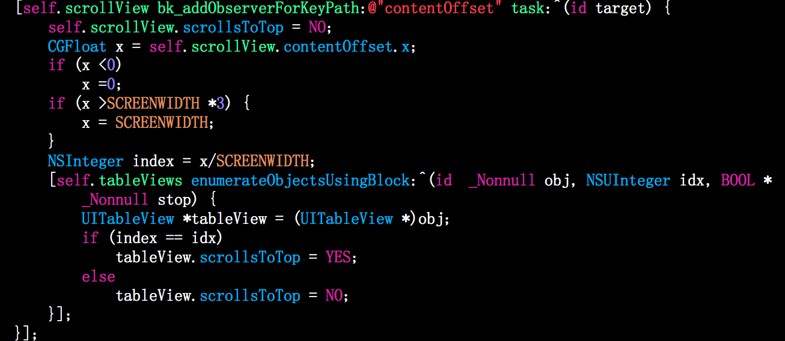

# EffectiveDemos
## ScrollToTop
一个viewController上面有多个scrollview的时候，点击statusbar，scrollview不能滑到顶部。这里提供一个解决办法，用kvo检测大的scrollview的contentoffset，而后设置那个scrollview的scrollsToTop为真 
代码如下： 
`[self.scrollView bk_addObserverForKeyPath:@"contentOffset" task:^(id target) {
    self.scrollView.scrollsToTop = NO;
    CGFloat x = self.scrollView.contentOffset.x;
    if (x <0)
        x =0;
    if (x >SCREENWIDTH *3) {
        x = SCREENWIDTH;
    }
    NSInteger index = x/SCREENWIDTH;
    [self.tableViews enumerateObjectsUsingBlock:^(id  _Nonnull obj, NSUInteger idx, BOOL * _Nonnull stop) {
        UITableView *tableView = (UITableView *)obj;
        if (index == idx)
            tableView.scrollsToTop = YES;
        else
            tableView.scrollsToTop = NO;
    }];
}];`
 图片如下： 
  
> 本demo参考:[iOS开发——实用技术OC片&点击状态栏回到顶部](http://www.cnblogs.com/iCocos/p/4777497.html)