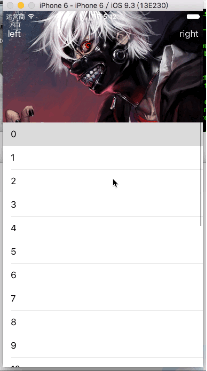
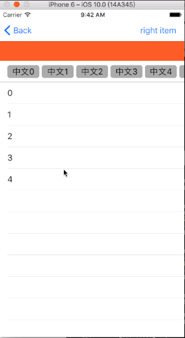

# EffectiveDemos
## ScrollToTop
一个viewController上面有多个scrollview的时候，点击statusbar，scrollview不能滑到顶部。这里提供一个解决办法，用kvo检测大的scrollview的contentoffset，而后设置那个scrollview的scrollsToTop为真<br \>
代码如下：<br \>

```
[self.scrollView bk_addObserverForKeyPath:@"contentOffset" task:^(id target) {
    self.scrollView.scrollsToTop = NO;
    CGFloat x = self.scrollView.contentOffset.x;
    if (x <0)
        x =0;
    if (x >SCREENWIDTH *3) {
        x = SCREENWIDTH;
    }
    NSInteger index = x/SCREENWIDTH;
    [self.tableViews enumerateObjectsUsingBlock:^(id  _Nonnull obj, NSUInteger idx, BOOL * _Nonnull stop) {
        UITableView *tableView = (UITableView *)obj;
        if (index == idx)
            tableView.scrollsToTop = YES;
        else
            tableView.scrollsToTop = NO;
    }];
}];
```
<br \>图片如下：<br \>
<br \> 
> 本demo参考:[iOS开发——实用技术OC片&点击状态栏回到顶部](http://www.cnblogs.com/iCocos/p/4777497.html)<br \> 
> 本demo使用的第三方:[BlocksKit](https://github.com/zwaldowski/BlocksKit)


##TableHeaderView
一个tableview上面有图片放置顶部，滑动tableview会有相对应的图片的放大缩小效果，同时按照判断来修改statusbar的颜色，修改navigationbar的颜色等等<br \>
代码如下:<br \>

	//观测tableview的contentoffset
    [self.tableView bk_addObserverForKeyPath:@"contentOffset" task:^(id target) {
        CGFloat y = self.tableView.contentOffset.y;
        CGFloat alpha = 0;
        if (y <=-headerHeight) {
            alpha =0;
                      
            //这里修改背景图片的frame，有放大缩小功能            
            CGFloat compY = (fabs(y) - headerHeight)*scale;
            CGRect rect = _imageViewHeader.frame;
            rect.origin.y = y;
            rect.size.height = fabs(y) ;
            rect.origin.x = -compY;
            rect.size.width = SCREENWIDTH + compY*2;
            _imageViewHeader.frame = rect;
        } else {
            alpha = (y +headerHeight)/(headerHeight -64);
            
            //修改vc标题
            self.titleLabel.textColor = y >=-64?[UIColor blackColor]:[UIColor clearColor];
            
            //修改statusbar外观
            [[UIApplication sharedApplication] setStatusBarStyle:y>=-64? UIStatusBarStyleDefault:UIStatusBarStyleLightContent];
            [self setNeedsStatusBarAppearanceUpdate];
        }
        
        //这里修改navigitionitem的tintcolor
        self.navigationItem.leftBarButtonItem.tintColor = self.navigationItem.rightBarButtonItem.tintColor = (y<=-headerHeight?[UIColor whiteColor]:[UIColor blackColor]);
        
        //设置navigationbar的alpha
        [[[self.navigationController.navigationBar subviews] objectAtIndex:0] setAlpha:alpha];
    }];
    
<br \>图片如下：<br \>
<br \> 
> 本demo参考:[senge7890/CDTableViewHeaderDemo](https://github.com/senge7890/CDTableViewHeaderDemo), [ios 7 statusbar 状态栏 跟随navigationbar的颜色而改变](http://blog.csdn.net/xiaoxuan415315/article/details/22810179)<br \> 
> 本demo使用的第三方:[BlocksKit](https://github.com/zwaldowski/BlocksKit), [Masonry](https://github.com/SnapKit/Masonry)


##ViewControllerTransition
iOS7之后自定义控制器之间的转场<br \>
图片如下：<br \>
<br \> 
demo中重要实现的是要定义遵从UIViewControllerAnimatedTransitioning代理的对象，同事实现代理方法：<br >
实现自定义动画

```
- (void)animateTransition:(id<UIViewControllerContextTransitioning>)transitionContext{}
```
返回自定义转场时间

```
- (NSTimeInterval)transitionDuration:(id<UIViewControllerContextTransitioning>)transitionContext{}
```

- (nullable __kindof UIView *)viewForKey:(NSString *)key NS_AVAILABLE_IOS(8_0);是iOS8以后才能使用，因此我这里没有使用这个系统提供的方法，而是使用以下系统提供的方法

```
UINavigationController *fromNav = [transitionContext viewControllerForKey:UITransitionContextFromViewControllerKey];
    UINavigationController *toNav = [transitionContext viewControllerForKey:UITransitionContextToViewControllerKey];
    UIView *containView = [transitionContext containerView];
```
在具体动画实现中使用了截图大法😁😝

##ScrollComponent
视图控制前上面的tableview上下滑动时响应scrollview代理

```
-(void)scrollViewWillEndDragging:(UIScrollView *)scrollView withVelocity:(CGPoint)velocity targetContentOffset:(inout CGPoint *)targetContentOffset {
    CGFloat screenHeight = [UIScreen mainScreen].bounds.size.height;
    if (velocity.y > 0.0) {
        //向上滑动隐藏导航栏
        [UIView animateWithDuration:0.2 animations:^{
            [self.navigationController setNavigationBarHidden:YES];
            self.topOne.transform = CGAffineTransformMakeTranslation(0, -20);
            self.topTwo.transform = CGAffineTransformMakeTranslation(0, -20);
            self.tableView.transform = CGAffineTransformMakeTranslation(0, -20);
            CGRect rect = self.tableView.frame;
            self.tableView.frame = CGRectMake(rect.origin.x, rect.origin.y, rect.size.width, screenHeight -40 -20);
        } completion:^(BOOL finished) {
            _hidden = YES;
        }];
    }else {
        //向下滑动显示导航栏
        [UIView animateWithDuration:0.2 animations:^{
            [self.navigationController setNavigationBarHidden:NO];
            self.topOne.transform = CGAffineTransformIdentity;
            self.topTwo.transform = CGAffineTransformIdentity;
            self.tableView.transform = CGAffineTransformIdentity;
            CGRect rect = self.tableView.frame;
            self.tableView.frame = CGRectMake(rect.origin.x, rect.origin.y, rect.size.width, screenHeight - 40 -44 - 64);
        } completion:^(BOOL finished) {
            _hidden = NO;
        }];
    }
}
```
下面代码是将原始数据按照是否选中降序排列，原始数据的index升序排列，得到新需要的数据

```
//数组排序
- (void)sortArray {
    NSSortDescriptor *sortDescriporPrimary = [NSSortDescriptor sortDescriptorWithKey:@"select" ascending:NO];
    NSSortDescriptor *sortDescriporSecondary = [NSSortDescriptor sortDescriptorWithKey:@"index" ascending:YES];
    [_originArray sortUsingDescriptors:@[sortDescriporPrimary,sortDescriporSecondary]];
}
```
<br \> 